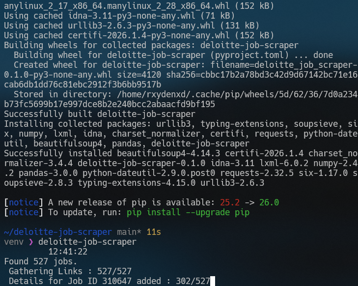

A Python project which scrapes all the job listings from Deloitte USI Career page.

## Prerequisites
- Python `3.10+`
- `pip`

## Installation
```bash
# cd desired/installation/path
git clone https://github.com/meshramanirudh/deloitte-job-scraper
cd deloitte-job-scraper
python3 -m venv venv # Create a virtual environment
source bin/activate/activate # for Linux
pip install . # Install project dependencies
# pip install -e .   For installing and editing:
```

## Usage
After following the installation steps simply run

```
deloitte-job-scraper
```

**Here's what it should look like:**


**Typical Output**:
```
Found X jobs.
	
	Gathering Links : ABC/XYZ
	Details for Job ID 123456 added : ABC/XYZ

Saved deloitte_jobs.csv in path/to/your/project_installation
```
`deloitte_jobs.csv` will be saved in the root directory of your project installation.

| jobCode | jobTitle | jobDescription |
| ------- | -------- | -------------- |
| 123     | title    | description    |
|         |          |                |

## Disclaimer

This project is for educational purposes only. It demonstrates web scraping techniques using public web pages. The author does not store, distribute, or claim ownership of any scraped data. Users are responsible for complying with the terms of service of the websites they access.

## License
MIT License
